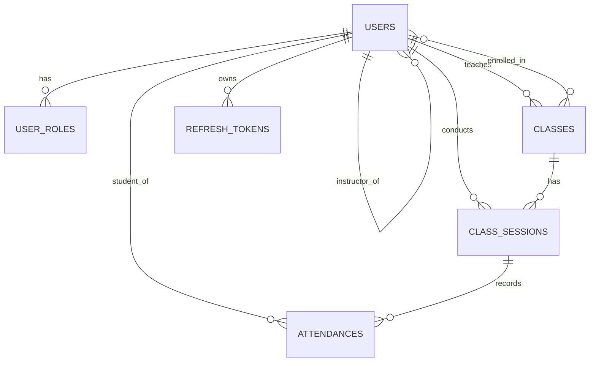

# 02 — Domain Model

Authoritative entity spec. All entities use UUID primary keys, snake_case DB column names, and TypeORM `@CreateDateColumn` / `@UpdateDateColumn` for `created_at` / `updated_at`. **Soft delete via `@DeleteDateColumn` (`deleted_at`)** replaces the v1 `isActive` boolean.

## Enums (`src/common/enums.ts`)

```ts
export enum Belt {
  WHITE = 'white',
  YELLOW = 'yellow',
  ORANGE = 'orange',
  GREEN = 'green',
  BLUE = 'blue',
  BROWN = 'brown',
  BLACK = 'black',
}

export enum UserRoleType {
  STUDENT = 'student',
  TEACHER = 'teacher',
}

export enum AttendanceStatus {
  PENDING = 'pending',
  PRESENT = 'present',
  LATE = 'late',
  ABSENT = 'absent',
  EXCUSED = 'excused',
}

export enum DayOfWeek {
  SUNDAY = 0,
  MONDAY = 1,
  TUESDAY = 2,
  WEDNESDAY = 3,
  THURSDAY = 4,
  FRIDAY = 5,
  SATURDAY = 6,
}
```

## User (`users` table)

A unified table for teachers and students. Role is stored in the related `user_roles` table.

| Column           | Type         | Null  | Default | Notes                                                            |
| ---------------- | ------------ | ----- | ------- | ---------------------------------------------------------------- |
| `id`             | uuid         | no    | gen     | PK                                                               |
| `name`           | varchar      | no    |         |                                                                  |
| `registry`       | varchar      | yes   |         | Unique (constraint `uq_users_registry`). Login identifier for teachers. |
| `password`       | varchar      | yes   |         | bcrypt hash. `@Exclude()` from serialization.                    |
| `belt`           | enum `Belt`  | no    | `WHITE` |                                                                  |
| `birthday`       | date         | yes   |         |                                                                  |
| `training_since` | date         | yes   |         |                                                                  |
| `instructor_id`  | uuid         | yes   |         | FK → `users.id` (self-relation). RESTRICT on delete. The teacher who owns this student. Null for teachers themselves. |
| `created_at`     | timestamptz  | no    | now()   |                                                                  |
| `updated_at`     | timestamptz  | no    | now()   |                                                                  |
| `deleted_at`     | timestamptz  | yes   |         | `@DeleteDateColumn`. Non-null ⇒ soft-deleted.                    |

**Relations**:
- `roles` — `OneToMany(UserRole)`, cascade insert.
- `instructor` — `ManyToOne(User, students)`, joinColumn `instructor_id`.
- `students` — `OneToMany(User, instructor)`.
- `classes` — `OneToMany(Class, teacher)` (classes this user teaches).
- `enrolledClasses` — `ManyToMany(Class, enrolledStudents)` via `class_enrollments`.
- `sessions` — `OneToMany(ClassSession, teacher)`.
- `attendances` — `OneToMany(Attendance, student)`.

**Indexes**:
- `idx_users_deleted_at` on `(deleted_at)` — common WHERE filter.
- `idx_users_deleted_name` on `(deleted_at, name)` — for sorted listing.
- `idx_users_instructor_id` on `(instructor_id)` — teacher's student list.

**Constraints**:
- `uq_users_registry` UNIQUE on `registry`.

## UserRole (`user_roles` table)

| Column   | Type                 | Null | Notes                                            |
| -------- | -------------------- | ---- | ------------------------------------------------ |
| `id`     | uuid                 | no   | PK                                               |
| `user_id`| uuid                 | no   | FK → `users.id`, ON DELETE CASCADE.              |
| `role`   | enum `UserRoleType`  | no   |                                                  |

**Constraints**:
- `uq_user_roles_user_role` UNIQUE on `(user_id, role)` — each user has each role at most once.

No timestamps, no soft delete. A user can have both `STUDENT` and `TEACHER` roles simultaneously.

## Class (`classes` table)

A recurring class definition (e.g. "Mon/Wed/Fri 18:30, 90min").

| Column             | Type           | Null | Default | Notes                                                            |
| ------------------ | -------------- | ---- | ------- | ---------------------------------------------------------------- |
| `id`               | uuid           | no   | gen     | PK                                                               |
| `name`             | varchar        | no   |         |                                                                  |
| `days`             | text           | no   |         | `simple-array` of `DayOfWeek` values (e.g. `"1,3,5"`). 1-7 days. |
| `start_time`       | time           | no   |         | HH:MM.                                                           |
| `duration_minutes` | int            | no   |         | 30 ≤ x ≤ 300. Constraint `chk_classes_duration`.                 |
| `teacher_id`       | uuid           | no   |         | FK → `users.id`. ON DELETE RESTRICT (`fk_classes_teacher_id`).   |
| `created_by`       | uuid           | no   |         | FK → `users.id`. RESTRICT. Audit field.                          |
| `updated_by`       | uuid           | no   |         | FK → `users.id`. RESTRICT. Audit field. Updated on every save.   |
| `created_at`       | timestamptz    | no   | now()   |                                                                  |
| `updated_at`       | timestamptz    | no   | now()   |                                                                  |
| `deleted_at`       | timestamptz    | yes   |         | `@DeleteDateColumn`.                                             |

**Relations**:
- `teacher` — `ManyToOne(User, classes)`, RESTRICT.
- `enrolledStudents` — `ManyToMany(User, enrolledClasses)` via `class_enrollments` join table.
- `sessions` — `OneToMany(ClassSession, class)`.

**Indexes**:
- `idx_classes_teacher_id` on `(teacher_id)`.
- `idx_classes_deleted_at` on `(deleted_at)`.

## class_enrollments (join table)

| Column     | Type | Notes                                              |
| ---------- | ---- | -------------------------------------------------- |
| `class_id` | uuid | FK → `classes.id`. CASCADE on class delete.        |
| `user_id`  | uuid | FK → `users.id`. RESTRICT.                         |

**Constraints**:
- Composite PK `(class_id, user_id)` — also serves as the lookup index.

## ClassSession (`class_sessions` table)

A single instance of a class on a specific date.

| Column        | Type        | Null | Default | Notes                                                            |
| ------------- | ----------- | ---- | ------- | ---------------------------------------------------------------- |
| `id`          | uuid        | no   | gen     | PK                                                               |
| `date`        | date        | no   |         |                                                                  |
| `start_time`  | time        | yes  |         | Set by `PATCH /class-sessions/:id/start` (=current time).        |
| `end_time`    | time        | yes  |         | Set by `PATCH /class-sessions/:id/end`.                          |
| `notes`       | varchar(500)| yes  |         |                                                                  |
| `class_id`    | uuid        | no   |         | FK → `classes.id`. RESTRICT.                                     |
| `teacher_id`  | uuid        | no   |         | FK → `users.id`. RESTRICT.                                       |
| `created_by`  | uuid        | no   |         | FK → `users.id`. RESTRICT.                                       |
| `updated_by`  | uuid        | no   |         | FK → `users.id`. RESTRICT.                                       |
| `created_at`  | timestamptz | no   | now()   |                                                                  |
| `updated_at`  | timestamptz | no   | now()   |                                                                  |
| `deleted_at`  | timestamptz | yes  |         | `@DeleteDateColumn`.                                             |

**Constraints**:
- `uq_class_sessions_class_date` UNIQUE on `(class_id, date)` where `deleted_at IS NULL` — partial unique index so a deleted session doesn't block a re-create.

**Indexes**:
- `idx_class_sessions_date_class` on `(date, class_id)` — covers `findByClass`, `findByDateRange`.
- `idx_class_sessions_deleted_at` on `(deleted_at)`.

## Attendance (`attendances` table)

| Column              | Type                    | Null | Default   | Notes                                                            |
| ------------------- | ----------------------- | ---- | --------- | ---------------------------------------------------------------- |
| `id`                | uuid                    | no   | gen       | PK                                                               |
| `is_enrolled_class` | boolean                 | no   | `true`    | Captures enrollment state **at record creation** (audit-stable). |
| `status`            | enum `AttendanceStatus` | no   | `PENDING` |                                                                  |
| `checked_in_at`     | timestamptz             | yes  |           | Auto-set when status becomes `PRESENT` or `LATE`.                |
| `notes`             | text                    | yes  |           |                                                                  |
| `session_id`        | uuid                    | no   |           | FK → `class_sessions.id`. ON DELETE CASCADE.                     |
| `student_id`        | uuid                    | no   |           | FK → `users.id`. ON DELETE RESTRICT.                             |
| `created_by`        | uuid                    | no   |           | FK → `users.id`. RESTRICT.                                       |
| `updated_by`        | uuid                    | no   |           | FK → `users.id`. RESTRICT.                                       |
| `created_at`        | timestamptz             | no   | now()     |                                                                  |
| `updated_at`        | timestamptz             | no   | now()     |                                                                  |
| `deleted_at`        | timestamptz             | yes  |           | `@DeleteDateColumn`.                                             |

**Constraints**:
- `uq_attendances_session_student` UNIQUE on `(session_id, student_id)` where `deleted_at IS NULL`.

**Indexes**:
- `idx_attendances_session_id` on `(session_id)`.
- `idx_attendances_student_id` on `(student_id)`.

## RefreshToken (`refresh_tokens` table) — NEW for v2

Tracks issued refresh tokens for the access + refresh JWT flow (see [04-auth-and-rbac.md](04-auth-and-rbac.md)).

| Column        | Type        | Null | Notes                                                                             |
| ------------- | ----------- | ---- | --------------------------------------------------------------------------------- |
| `id`          | uuid        | no   | PK                                                                                |
| `user_id`     | uuid        | no   | FK → `users.id`. ON DELETE CASCADE.                                               |
| `token_hash`  | varchar     | no   | bcrypt of the issued opaque token. Never store the raw token.                     |
| `family_id`   | uuid        | no   | Refresh-token family. Reuse of a revoked token revokes the entire family.         |
| `expires_at`  | timestamptz | no   | 30 days from issuance.                                                            |
| `revoked_at`  | timestamptz | yes  | Set when consumed (rotated) or invalidated.                                       |
| `replaced_by` | uuid        | yes  | FK → `refresh_tokens.id`. Self-relation. Points to the rotation successor.        |
| `created_at`  | timestamptz | no   |                                                                                   |
| `user_agent`  | varchar     | yes  | For diagnostics.                                                                  |
| `ip`          | varchar     | yes  | For diagnostics.                                                                  |

**Indexes**:
- `idx_refresh_tokens_user_id` on `(user_id)`.
- `idx_refresh_tokens_family_id` on `(family_id)`.

## ER diagram



## Key invariants (enforced in DB or service)

- A user with role `STUDENT` MUST have `instructor_id` set.
- A user with role `TEACHER` MUST NOT have `instructor_id` set (enforced in `UsersService.create`).
- A class's `teacher_id` MUST point to a user that has the `TEACHER` role.
- An attendance's `student_id` MUST point to a user that has the `STUDENT` role.
- `class_sessions.teacher_id` defaults to `classes.teacher_id` but can differ (substitute teacher).
- `attendances.is_enrolled_class` is computed once at insert time by checking `class_enrollments`. It does not auto-update if enrollment changes later — that's intentional (audit stability).
